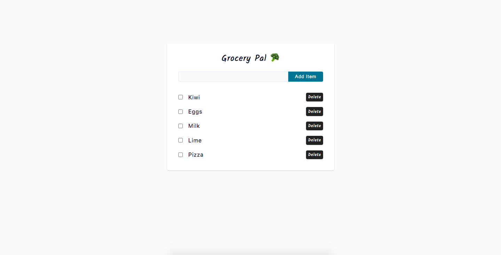

# Grocery Pal 🥦



## Project Description

**Grocery Pal** is a feature-rich `CRUD (Create, Read, Update, Delete)` application built using `Vite` and `React.js`. It offers users a convenient and reliable solution to manage their grocery or errand items. Users can seamlessly add, read, update, and delete items while ensuring that their information is persistently stored even after refreshing the application.

__Key Features__:

- Item Management: Users can easily add, view, update, and delete `(CRUD)` grocery or errand items through a user-friendly interface.
- Persistent Data: The application employs efficient data management techniques to save and retrieve user items, ensuring that the information is preserved even after refreshing the application or closing the browser.
- Interactive Notifications: `React Toastify` is integrated into the application to provide real-time notifications and feedback to the user during item management operations, enhancing the user experience.
- Responsive Design: The application is designed to be responsive, allowing users to access and manage their grocery or errand items seamlessly across different devices and screen sizes.
- Unique Item IDs: The `Nanoid library` is utilized to generate unique IDs for each item, enabling smooth identification and updating of specific items.

With **Grocery Pal**, users can conveniently organize and manage their grocery or errand items, enjoying the flexibility of adding, editing, and deleting items while ensuring data persistence.

## Important Links

- https://grocerypal-gp.netlify.app/

### Setup Steps

1. [Fork and Clone](https://github.com/iamatos3/grocery-pal) this repository.
2. ```npm install```
3. ```npm run dev```

### Technologies Used

- Vite
- React.js
- React Toastify
- HTML
- CSS
- Nanoid Library